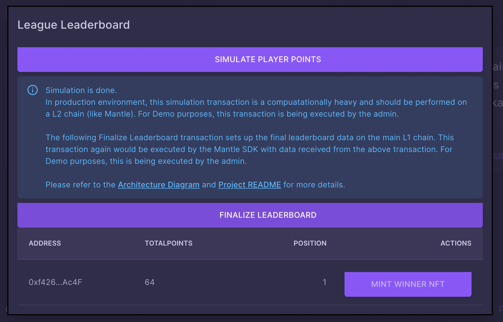

# Fantasy Sporting
A fantasy sport is a form of game, commonly played on the Internet, in which participants assemble imagined, or virtual teams made up of proxies for genuine professional athletes. These gamers qualify based on their players’ statistical performance in actual games and this performance is then transformed into points which are collated and totaled based on a roster chosen by the Fantasy Sporting Administrator.

LeagueX3 is the all-in-one blockchain based platform for all fantasy gaming on the OpenWeb. LeagueX3 allows the users to participate in several fantasy gaming leagues based on actual competitions in any sport, and thus allowing users to win rewards based on their participation. LeagueX3 also allows admins to reward users with winnings in the form of NFTs.  

We plan to bring all the fun of Fantasy sports to the Open Web and leverage the most rapidly growing and lucrative online industry. For starters, online fantasy gaming has a current market size of US$18.6 billion and an expected growth of $48.6 billion by 2027. Since the lure of Fantasy Sports has charmed Sports enthusiasts all over the world, on the other side of the world: India, the Fantasy Sports sector is growing at a CAGR of 32%, and is slated to reach US$3.7 billion by 2024.

## Fantasy Sports on Blockchain
Blockchain is the ready solution to all the centralization and trust issues. Fantasy Sports platforms are rapidly embracing blockchain technology today, to design a decentralized, fraud-proof and 100% transparent system. Not only does blochain permits and ensure that users enjoy a fair play experience, but it also makes fantasy sports more accountable and transparent.

To be precise, using blockchain will help in retaining reliability and transparency of the industry in a decentralized manner along with giving the users a fair game experience.

### Video Demo Link
```
https://youtu.be/BTXoP9JNRHU
```

### User App Demo
```
https://mantle-fantasy-sports.vercel.app/
```

## Admin App Demo
```
https://mantle-fantasy-sports-admin.vercel.app/
```

## Using Mantle in Gaming Experience (Submission MVP)

From the [Game7 Report](https://cdn.game7.io/reports/Game-Developer-Report-by-Game7.pdf),

1. Synchronizing on-chain/off-chain data can be a troublesome task. Because there is no standard, game devs are creating standalone solutions.

2. There exists no framework to manage and relay transactions across L1 and L2 chains for heavy compuatations required by game devs. 


Our Solution plans to remediate the above 2 game development pain points by creating a demo framework using L1 and L2 chains. On a high level, the solution proposes to use the Mantle SDK to offload computationally heavy transactions to an L2 chain (where the gas fees are comparatively lower), while keeping the traceability of all computational transactions, and relaying the results over the to L1 chain. 

The following high level diagram explains the framework approach and the usage of mantle SDK with both L1 and L2 chains. 


## Demo Leaderboard Functionality


This workflow is available in the admin app and the connected account can be used to:

1. Simulate Player Points: This is a transaction that will be executed on the L2 chain for lower gas consumption and maintaining transaction traceability. The results of this calculation are then relayed to the L1 chain where the driving Smart Contract is deployed. 

2. Finalize Leaderboard: In production environment, this transaction would be executed by the Mantle SDK which essentially calls the L1 contract from the L2 chain with the results obtained from [1] above. 

Note: Both these transactions have been enabled manually for demonstration purposes. 

## Deployed Smart Contracts
1. Datastore Smart Contract containing the matches and leagues information: [Datstore Contract: 0x2c7aF0B5a7cd6E777E14F9CB6213195f5aD450B1](https://explorer.testnet.mantle.xyz/address/0x2c7aF0B5a7cd6E777E14F9CB6213195f5aD450B1)

2. League Smart Contract responsible for user participation and managing leaderboards for a league: [LeagueX3 Core Contract 0x656F7c6dc0747AC8e64BF013a14e56F7dA68308A](https://explorer.testnet.mantle.xyz/address/0x656F7c6dc0747AC8e64BF013a14e56F7dA68308A)

3. LeagueRewards Smart Contract responsible for managing League Reward NFTs and other winnings for the participating users: [League Rewards Contract 0x700E9BeBA6db645380d9FC59C1b25509B41FEa7a](https://explorer.testnet.mantle.xyz/address/0x700E9BeBA6db645380d9FC59C1b25509B41FEa7a)

## Demo Transactions
The transaction hashes used in the video demo have are listed below for accessibility:

1. [User Participating in the League](https://explorer.testnet.mantle.xyz/tx/0xc2f97ff8c650bd0262cafe441924829e17ee669ddce7216527904e49dbbaba45): 0xc2f97ff8c650bd0262cafe441924829e17ee669ddce7216527904e49dbbaba45 with a value of 20 BIT tokens

2. [Simulating Player Points by Admin](https://explorer.testnet.mantle.xyz/search-results?q=0x5dbb202c359b4f859ccb4d78a7bfbff8952b63abadf694cad796e75479a18052): 0x5dbb202c359b4f859ccb4d78a7bfbff8952b63abadf694cad796e75479a18052

3. [Finalizing the league leaderboard by admin](https://explorer.testnet.mantle.xyz/tx/0x6388a56f01d0a19c1f154ca5cedfac62e0a03d1160c6978b15f7d1dddbbd53c8): 0x6388a56f01d0a19c1f154ca5cedfac62e0a03d1160c6978b15f7d1dddbbd53c8

4. [Minting Runners up NFT by admin](https://explorer.testnet.mantle.xyz/tx/0x0ec3b3438c742887465ced7e7ae87db071a34141bc2bca19f46228635adfd30d): 0x0ec3b3438c742887465ced7e7ae87db071a34141bc2bca19f46228635adfd30d (Runners up NFT)


## Running the client frontend
Clone this repo and execute the following commands to run the client frontend
```
cd frontend
yarn
yarn dev
```
Client dApp should now be running on `http://localhost:3000`

## Running the admin frontend
Clone this repo and execute the following commands to run the admin frontend
```
cd admin-frontend
yarn
yarn dev
```
Admin dApp should now be running on `http://localhost:3001`


