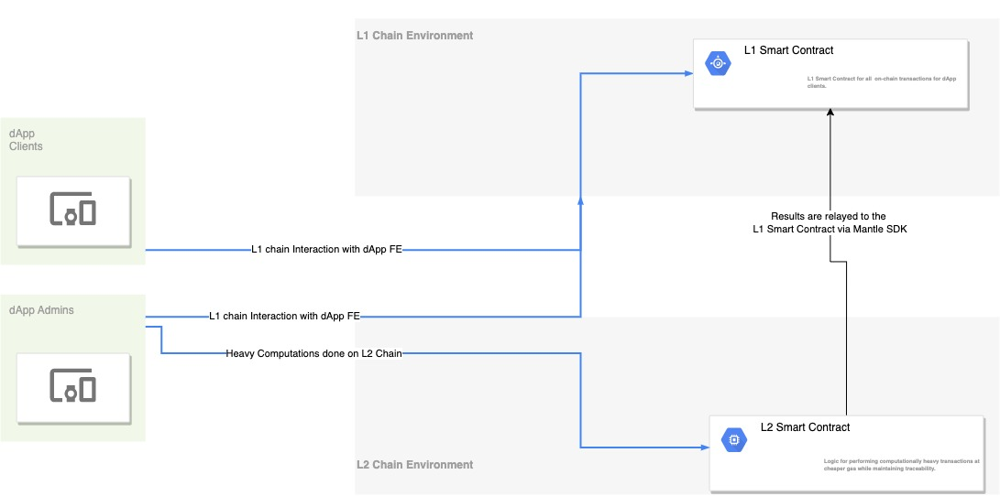

# Fantasy Sporting
A fantasy sport is a form of game, commonly played on the Internet, in which participants assemble imagined, or virtual teams made up of proxies for genuine professional athletes. These gamers qualify based on their players’ statistical performance in actual games and this performance is then transformed into points which are collated and totaled based on a roster chosen by the Fantasy Sporting Administrator.

We plan to bring all the fun of Fantasy sports to the Open Web and leverage the most rapidly growing and lucrative online industry. For starters, online fantasy gaming has a current market size of US$18.6 billion and an expected growth of $48.6 billion by 2027. Since the lure of Fantasy Sports has charmed Sports enthusiasts all over the world, on the other side of the world: India, the Fantasy Sports sector is growing at a CAGR of 32%, and is slated to reach US$3.7 billion by 2024.

### Fantasy Sports on Blockchain
Blockchain is the ready solution to all the centralization and trust issues. Fantasy Sports platforms are rapidly embracing blockchain technology today, to design a decentralized, fraud-proof and 100% transparent system. Not only does blochain permits and ensure that users enjoy a fair play experience, but it also makes fantasy sports more accountable and transparent.
To be precise, using blockchain will help in retaining reliability and transparency of the industry in a decentralized manner along with giving the users a fair game experience.

### Using Mantle in Gaming Experience (Submission MVP)
From the [Game7 Report](https://cdn.game7.io/reports/Game-Developer-Report-by-Game7.pdf), 
    1. Synchronizing on-chain/off-chain data can be a troublesome task. Because there is no standard, game devs are creating standalone solutions.
    2. There exists no framework to manage and relay transactions across L1 and L2 chains for heavy compuatations required by game devs. 

Our Solution plans to remediate the above 2 game development pain points by creating a demo framework using L1 and L2 chains. On a high level, the solution proposes to use the Mantle SDK to offload computationally heavy transactions to an L2 chain (where the gas fees are comparatively lower), while keeping the tracibility of all computational transactions, and relaying the results over the to L1 chain. 
The following high level diagram explains the framework approach and the usage of mantle SDK with both L1 and L2 chains. 

